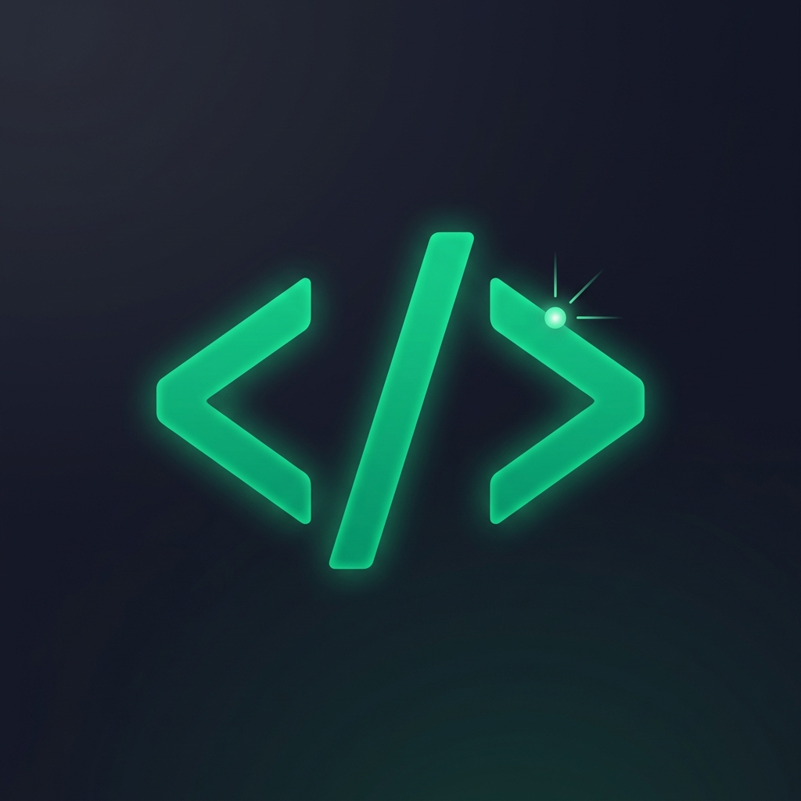

<div align="center">
  
  <h1>CodeSage AI</h1>
  <p><strong>Expert Code Reviews Inside VS Code. Powered by DeepSeek.</strong></p>

  <p>
    <a href="https://marketplace.visualstudio.com/items?itemName=SamiullahAtta.codesage-ai"></a>
    <a href="https://marketplace.visualstudio.com/items?itemName=SamiullahAtta.codesage-ai"></a>
    <a href="https://github.com/Abdus-Sami01/codesage-ai/blob/main/LICENSE.txt"></a>
  </p>
</div>

---

## The Modern Developer's Review Assistant

CodeSage AI is a highly specialized code review assistant that lives directly inside your editor. It analyzes your codebase on the fly, streaming actionable feedback instantly. 

Whether you need a rigorous security audit, performance tuning, or just a quick bug check, CodeSage acts as your personal Senior Staff Engineer, ensuring your fast-paced coding never sacrifices quality.

---

## Features at a Glance

<table>
  <tr>
    <td width="50%">
      <h3>Native Inline Diagnostics</h3>
      <p>Bugs and vulnerabilities are highlighted with native squiggly underlines right where you type. Never switch contexts to see your issues.</p>
    </td>
    <td width="50%">
      <h3>One-Click Quick Fixes</h3>
      <p>Hover over any issue and apply AI-generated code corrections instantly via VS Code's native Quick Fix lightbulb menu.</p>
    </td>
  </tr>
  <tr>
    <td width="50%">
      <h3>Specialized Profiles</h3>
      <p>Use the status bar to switch between <strong>General</strong>, <strong>Security Audit</strong>, <strong>Performance</strong>, and <strong>Clean Code</strong> modes to tailor the AI's focus.</p>
    </td>
    <td width="50%">
      <h3>Function-Level Granularity</h3>
      <p>CodeLens "Review" buttons appear above every class and method. Audit specific logic in total isolation with a single click.</p>
    </td>
  </tr>
</table>

### Multi-Language Support
Works out of the box with Python, JavaScript, TypeScript, C++, Java, Go, Rust, PHP, and any language with VS Code symbol support.

---

## Installation & Setup

1. Install the extension from the [VS Code Marketplace](https://marketplace.visualstudio.com/items?itemName=SamiullahAtta.codesage-ai).
2. Open the VS Code Command Palette (`Ctrl+Shift+P` or `Cmd+Shift+P`).
3. Run **`CodeSage: Set API Key`**.
4. Paste your HuggingFace API token (Get one for free at [HuggingFace](https://huggingface.co/settings/tokens)).
   > *Note: Your key is stored securely in VS Code's encrypted SecretStorage and is never written to disk.*
5. Ensure you have Python 3.8+ installed with the `huggingface_hub` package:
   ```bash
   pip install huggingface_hub
   ```

---

## Usage Guide

| Action | How to do it |
|---|---|
| **Review Entire File** | Open a file and press `Ctrl+Shift+R` (or run `CodeSage: Review Code`). |
| **Review Selection** | Highlight a block of code, then press `Ctrl+Shift+R`. |
| **Review Single Function** | Click the inline `Review` button above any function definition. |
| **Apply Quick Fix** | Hover over a squiggly line and click the lightbulb icon to apply the AI's fix. |
| **Switch Profile** | Click the `CodeSage` item in your bottom status bar. |

---

## Configuration Settings

You can customize CodeSage AI in your VS Code settings (`settings.json`):

| Setting | Default | Description |
|---|---|---|
| `codesage-ai.model` | `deepseek-ai/DeepSeek-R1` | The AI model used for reviews. |
| `codesage-ai.maxTokens` | `4096` | Maximum response length from the AI. |
| `codesage-ai.temperature` | `0.3` | Response creativity (0 to 1.5). Lower is more focused. |
| `codesage-ai.pythonPath` | `python` | Path to your local Python interpreter. |
| `codesage-ai.reviewProfile` | `general` | Default review focus profile. |
| `codesage-ai.enableCodeLens`| `true` | Toggle the inline 'Review' buttons above functions. |
| `codesage-ai.enableStreaming`| `true` | Stream results in real-time to the webview panel. |

---

## Architecture

CodeSage AI bridges the gap between the TypeScript VS Code API and a lightweight Python backend, allowing for highly efficient streaming inference.

```text
VS Code Extension (TypeScript)
  |
  |-- reviewCode.ts / reviewFunction.ts  (commands)
  |-- reviewService.ts                   (spawns Python subprocess)
  |-- reviewPanel.ts                     (Webview rendering)
  |-- diagnosticsProvider.ts             (inline squiggly lines)
  |
  v
code_review.py (Python backend)
  |-- Reads JSON from stdin
  |-- Calls HuggingFace API (DeepSeek model)
  |-- Writes streaming JSON lines to stdout
```

---

## Contributing

We welcome contributions! 

1. Fork the repository
2. Create a feature branch: `git checkout -b feature/my-feature`
3. Commit your changes: `git commit -m "Add my feature"`
4. Push to the branch: `git push origin feature/my-feature`
5. Open a Pull Request

## License

This project is licensed under the [Apache 2.0 License](LICENSE.txt).
