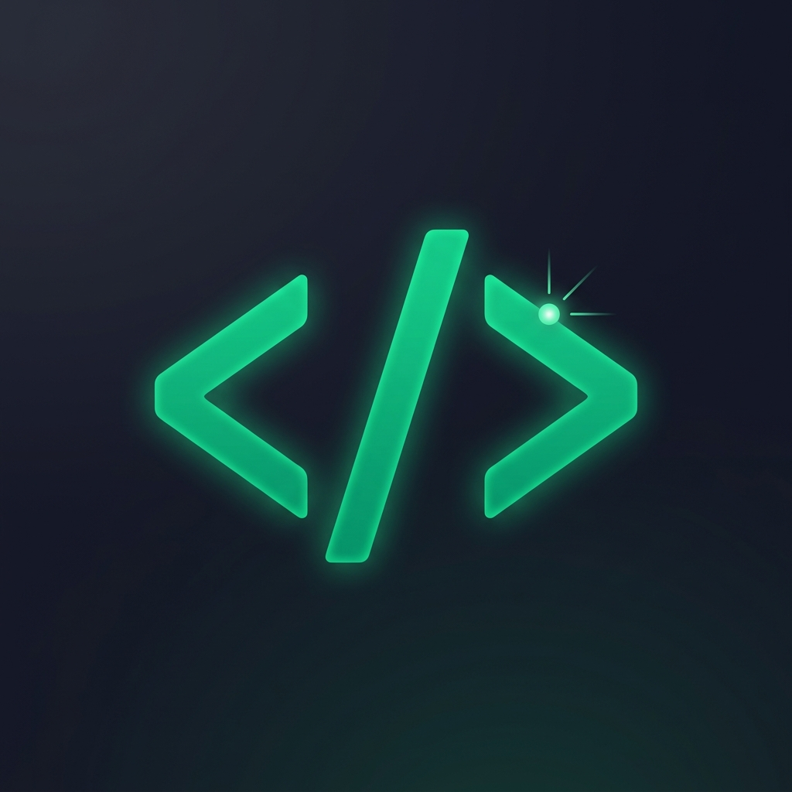

<div align="center">
  
  <h1>CodeSage AI</h1>
  <p><strong>Expert code reviews inside VS Code, on any model you can reach.</strong></p>

  <p>
    <a href="https://marketplace.visualstudio.com/items?itemName=SamiullahAtta.codecooksage-ai"></a>
    <a href="https://marketplace.visualstudio.com/items?itemName=SamiullahAtta.codecooksage-ai"></a>
    <a href="https://github.com/Abdus-Sami01/codesage-ai/blob/main/LICENSE.txt"></a>
  </p>
</div>

---

## The Modern Developer's Review Assistant

CodeSage AI is a code review assistant that lives directly inside your editor. It analyzes your code on the fly and streams actionable feedback back into a panel, inline squiggles and quick fixes.

Whether you need a security audit, performance tuning or a quick bug check, CodeSage gives you a senior reviewer on every file — on whichever model you point it at, and on as many of them as you care to line up.

---

## Features at a Glance

<table>
  <tr>
    <td width="50%">
      <h3>Native Inline Diagnostics</h3>
      <p>Bugs and vulnerabilities are highlighted with native squiggly underlines right where you type. Never switch contexts to see your issues.</p>
    </td>
    <td width="50%">
      <h3>One-Click Quick Fixes</h3>
      <p>Hover over any issue and apply AI-generated code corrections instantly via VS Code's native Quick Fix lightbulb menu.</p>
    </td>
  </tr>
  <tr>
    <td width="50%">
      <h3>Model Rotation</h3>
      <p>Rank as many models as you like. When one hits its rate limit CodeSage moves to the next and keeps going, so a spent quota slows you down instead of stopping you.</p>
    </td>
    <td width="50%">
      <h3>Any OpenAI-Compatible Provider</h3>
      <p>OpenRouter, OpenAI, a local Ollama, or a self-hosted OmniRoute gateway. Mix them in one pool — a local model can be the fallback that keeps working when the hosted ones run dry.</p>
    </td>
  </tr>
  <tr>
    <td width="50%">
      <h3>Specialized Profiles</h3>
      <p>Use the status bar to switch between <strong>General</strong>, <strong>Security Audit</strong>, <strong>Performance</strong>, and <strong>Clean Code</strong> modes to tailor the AI's focus.</p>
    </td>
    <td width="50%">
      <h3>Function-Level Granularity</h3>
      <p>CodeLens "Review" buttons appear above every class and method. Audit specific logic in total isolation with a single click.</p>
    </td>
  </tr>
</table>

### Multi-Language Support
Works out of the box with Python, JavaScript, TypeScript, C++, Java, Go, Rust, PHP, and any language with VS Code symbol support.

---

## Installation & Setup

1. Install the extension from the [VS Code Marketplace](https://marketplace.visualstudio.com/items?itemName=SamiullahAtta.codecooksage-ai).
2. Open the VS Code Command Palette (`Ctrl+Shift+P` or `Cmd+Shift+P`).
3. Run **`CodeSage: Set API Key`**.
4. Paste the API key for the provider you want to use.
   > *Note: Your key is stored securely in VS Code's encrypted SecretStorage and is never written to disk.*
5. Pick your provider in settings via `codesage-ai.provider`. Presets for OpenRouter, OpenAI and Ollama resolve their own endpoint; for a self-hosted gateway choose `omniroute` or `custom` and set `codesage-ai.baseUrl` (for example `http://localhost:8080/v1`).
6. Run **`CodeSage: Select Model`** to pick from the models your provider actually serves.

No Python, no local runtime, and no extra packages — the extension talks to the provider directly. A gateway on `localhost` or a private address needs no API key at all.

### Raising the ceiling

One key on one model runs out. Two things raise that ceiling, and they multiply:

- **More keys.** Run `CodeSage: Manage API Keys` and add another key for the same provider. Each one carries its own quota.
- **More models.** Rank models in `codesage-ai.routes`. Tier 1 is tried first; higher tiers are the fallbacks used only when everything better is throttled.

```jsonc
"codesage-ai.routes": [
  { "model": "anthropic/claude-sonnet-4", "provider": "openrouter", "tier": 1 },
  { "model": "deepseek-ai/DeepSeek-R1",   "provider": "openrouter", "tier": 2 },
  { "model": "qwen2.5-coder:14b",         "provider": "ollama",     "tier": 3 }
]
```

Three routes with two OpenRouter keys is five independently rate-limited slots. When a review lands on a fallback the panel says so, so you always know which model wrote the review you are reading. `CodeSage: Show Rotation Pool` lists every slot, its state, and when a paused one comes back.

---

## Usage Guide

| Action | How to do it |
|---|---|
| **Review Entire File** | Open a file and press `Ctrl+Shift+R` (or run `CodeSage: Review Code`). |
| **Review Selection** | Highlight a block of code, then press `Ctrl+Shift+R`. |
| **Review Single Function** | Click the inline `Review` button above any function definition. |
| **Apply Quick Fix** | Hover over a squiggly line and click the lightbulb icon to apply the AI's fix. |
| **Switch Profile** | Click the `CodeSage` item in your bottom status bar. |
| **Pick a Model** | Run `CodeSage: Select Model` to choose from the provider's live catalog. |
| **Add or Remove Keys** | Run `CodeSage: Manage API Keys`. |
| **Inspect the Pool** | Run `CodeSage: Show Rotation Pool` to see every route, its state, and its recovery time. |

---

## Configuration Settings

You can customize CodeSage AI in your VS Code settings (`settings.json`):

| Setting | Default | Description |
|---|---|---|
| `codesage-ai.provider` | `openrouter` | Provider preset: `openrouter`, `openai`, `ollama`, `omniroute` or `custom`. |
| `codesage-ai.baseUrl` | `""` | API base URL. Empty uses the preset default; required for `omniroute` and `custom`. |
| `codesage-ai.model` | `deepseek-ai/DeepSeek-R1` | Model identifier. Used as the only route when `routes` is empty. |
| `codesage-ai.routes` | `[]` | Ranked pool of models to rotate through. Replaces `model` when non-empty. |
| `codesage-ai.maxTokens` | `4096` | Maximum response length from the AI (up to 131072). |
| `codesage-ai.temperature` | `0.3` | Response creativity (0 to 2). Lower is more focused. |
| `codesage-ai.requestTimeoutMs` | `120000` | Abort after this much silence. While streaming the clock restarts on every chunk. `0` waits forever. |
| `codesage-ai.maxAttempts` | `6` | How many pool slots one review may try before giving up. |
| `codesage-ai.maxQueueWaitMs` | `15000` | Wait this long for a throttled route to recover before failing. `0` never waits. |
| `codesage-ai.reviewProfile` | `general` | Default review focus profile. |
| `codesage-ai.enableCodeLens`| `true` | Toggle the inline 'Review' buttons above functions. |
| `codesage-ai.enableStreaming`| `true` | Stream results in real-time to the webview panel. |

---

## Architecture

CodeSage AI is pure TypeScript and calls any OpenAI-compatible provider directly, streaming the response as it arrives. A review is not one request to one model: it is a walk over a pool of them.

```text
  commands / CodeLens / status bar
              |
              |  ReviewRequest
              v
  +---------------------------------+
  |          ReviewService          |   review() and reviewStream()
  |  attempt loop, timeouts, aborts |   are unchanged from the caller's side
  +----------------+----------------+
                   |
        acquire()  |  release(outcome)
                   v
  +---------------------------------+
  |          RotationPool           |   ordered (route x key) slots
  +--------+---------------+--------+
           |               |
           v               v
  +----------------+  +------------------------+
  |  RouteTable    |  |      QuotaLedger       |
  |  tier-ranked   |  |  live / in-flight /    |
  |  destinations  |  |  cooling / exhausted   |
  +----------------+  |  persisted in          |
                      |  globalState           |
                      +------------------------+
                   |
                   v
      POST {baseUrl}/chat/completions
      GET  {baseUrl}/models
        OpenRouter / OpenAI / Ollama / OmniRoute / any gateway
```

**How a slot recovers.** Every failure is classified once, at the edge, and the
provider's own `Retry-After` or `X-RateLimit-Reset` header decides how long the
pause lasts:

| What happened | What the pool does |
|---|---|
| `429` with a short reset | Pauses that slot until the reset, tries the next one |
| `429` with a long reset, or `402` | Marks the window spent; that slot sits out the hour |
| `401` / `403` | Parks that **key** on every route that shares it |
| `404` | Parks that **route** on every key |
| `400` about context length | Skips that route for this request only — its quota is untouched |
| `5xx`, timeout, network error | Short pause, immediate retry elsewhere |

Pauses are persisted, so a daily quota discovered on Monday evening is still
known about after a window reload. `CodeSage: Show Rotation Pool` prints the
whole table and can clear it.

---

## Contributing

We welcome contributions! 

1. Fork the repository
2. Create a feature branch: `git checkout -b feature/my-feature`
3. Commit your changes: `git commit -m "Add my feature"`
4. Push to the branch: `git push origin feature/my-feature`
5. Open a Pull Request

## License

This project is licensed under the [Apache 2.0 License](LICENSE.txt).
